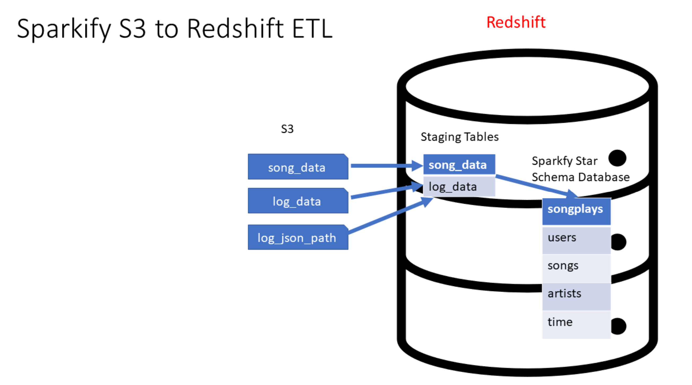
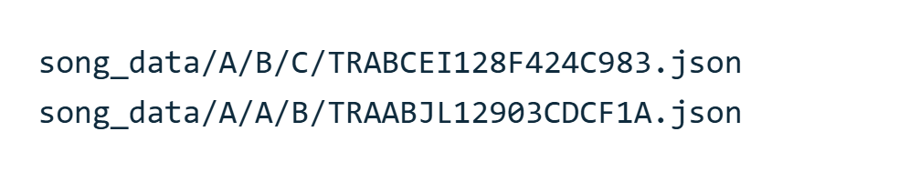
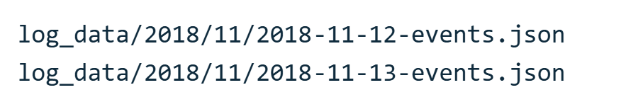
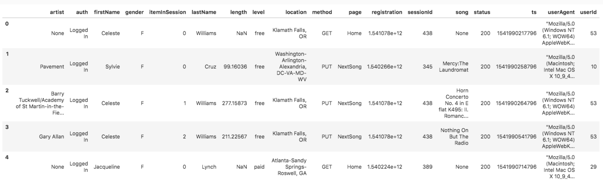
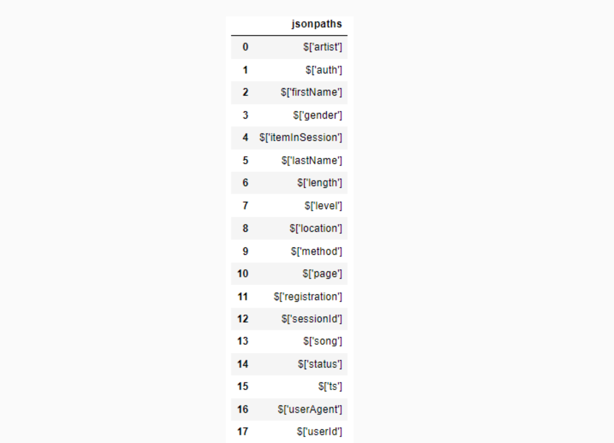
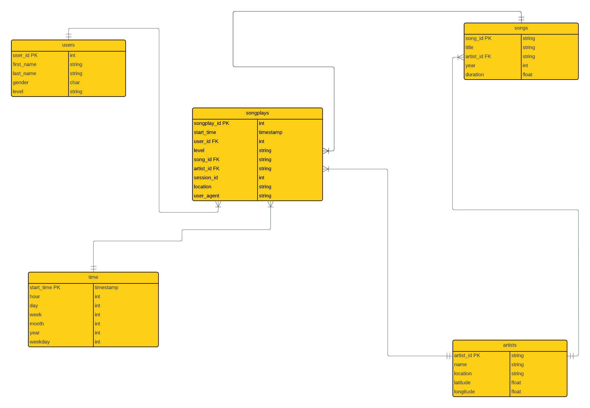

# System Data Warehouse Architecture for AWS S3 to Redshift ETL/ELT

## Introduction:
A music streaming startup, Sparkify, has grown their user base and song database and want to move their processes and data onto the cloud. Their data resides in S3, in a directory of JSON logs on user activity on the app, as well as a directory with JSON metadata on the songs in their app.

As their data engineer, I am building an ETL pipeline that extracts their data from S3, stages them in Redshift, and transforms data into a set of dimensional tables for their analytics team to continue finding insights into what songs their users are listening to.


*System Architecture for AWS S3 to Redshift ETL* 

This project, part of the Udacity Data Engineer Nanodegree, demonstrates creating a well-architected data warehouse, utilizing staging tables for data independence, and achieving high compute performance through bulk data loads from S3 to the Sparkify DWH in Redshift.

## 🚧 Steps Taken to Build the Project! 🚧
1. 🎯 Understood the data and data sources to kickstart the SQL ETL process.

2. 💰 Analyzed which analytics would be most beneficial for a music streaming company, helping Sparkify rake in more $$ and streamline processes.

3. 🎶 Designed the Star Schema ERD diagram based on the JSON data sources. ([Data Sources Explained Below](#where-sparkifys-data-gets-its-groove-on-🎶))

4. 🛠️ Created sql_queries.py to write the DROP, CREATE, staging, fact, and dimension tables for the STAR schema. This script feeds into create_table.py, where we end up creating the star schema in Redshift.

5. 🔒 Set up an IAM role with just the right permissions to create a Redshift cluster on AWS, following best practices of limited access and using generated access keys for our scripts.

6. 🧱 Used Infrastructure as Code (IaC) to create the roles and Redshift cluster just before the ETL step, minimizing unnecessary cloud expenses by keeping the cluster live only when needed.
Point 7

7. 🚀 Tackled etl.py, the script that loads data from S3 into staging tables on Redshift, then transforms it into our analytics tables.

8. 🧹 Tackled cleaning up of Redshift resources after, which we’d never do in production (unless we want to risk deleting everything we worked so hard to build—yikes!).

9. 🤖 Built [Infrastructure & Analytics Script.ipynb](https://github.com/trishh088/Data-Engineering-With-AWS/blob/main/Cloud%20Data%20Warehouses/Infrastructure%20%26%20Analytics%20Script.ipynb), which runs all the code sequentially from setting up te role, Redshift cluster, the create and ETL scripts, few analytical insights generated from the loaded data, and of course deleting the Redshift cluster post analysis (saved this to run last to avoid any massive Redshift bill!).

10. 📜 Finally, put together this README because good documentation is crucial. My mantra - never skip this step—it only creates chaos later. Been there, done that, never again!

## Where Sparkify's Data Gets Its Groove On!" 🎶

We have two datasets stored in S3 buckets.
1. Song Dataset:
The first dataset is a subset of real data from the [Million Song Dataset](http://millionsongdataset.com/) which provides a freely-available collection of audio features and metadata for a million contemporary popular music tracks.
Each file is in JSON format and contains metadata about a song and the artist of that song. The files are partitioned by the first three letters of each song's track ID.

For example, here are file paths to two files in this dataset.


    ``` json
    {"num_songs": 1, "artist_id": "ARJIE2Y1187B994AB7", "artist_latitude": null, "artist_longitude": null, "artist_location": "", "artist_name": "Line Renaud", "song_id": "SOUPIRU12A6D4FA1E1", "title": "Der Kleine Dompfaff", "duration": 152.92036, "year": 0}
    ```

2. Log Dataset:
This is the file we are using to collect event data which consists of log files in JSON format generated by this [event simulator](https://github.com/Interana/eventsim) based on the songs in the dataset above, curtosy of Udacity.
The log files in the dataset are partitioned by year and month. For example, here are file paths to two files in this dataset.

And below is an example of what the data in a log file, 2018-11-12-events.json, looks like.



    ##### Log JSON Metadata
    The log_json_path.json file is used when loading JSON data into Redshift. It specifies the structure of the JSON data so that Redshift can properly parse and load it into the staging tables.

    In the context of this project, we use the log_json_path.json file in the COPY command, which is responsible for loading the log data from S3 into the staging tables in Redshift. The log_json_path.json file tells Redshift how to interpret the JSON data and extract the relevant fields. This is essential for further processing and transforming the data into the desired analytics tables.

    Below is what data is in log_json_path.json.
    


## Star Schema for Sparkify Analytics


## Sparkify Analytics
Please refer the notebook for this - [Infrastructure & Analytics Script.ipynb](https://github.com/trishh088/Data-Engineering-With-AWS/blob/main/Cloud%20Data%20Warehouses/Infrastructure%20%26%20Analytics%20Script.ipynb)

## Challenges faced:
Making sure to not go over budget when using AWS credits to build this project which mimics real life scenarios where I have been tasked to solve a challenge without overshotting a budget or helping showcase our capabilities when I am helping out with business development for my company.

## Tools and Technologies used:
- AWS data platform tools:  
  - Simple Storage Service (S3)
  - AWS Redshift
  - AWS SDK for Python (Boto3)
- Python
- Postgres


## References:
1. Thierry Bertin-Mahieux, Daniel P.W. Ellis, Brian Whitman, and Paul Lamere. 
The Million Song Dataset. In Proceedings of the 12th International Society
for Music Information Retrieval Conference (ISMIR 2011), 2011.
